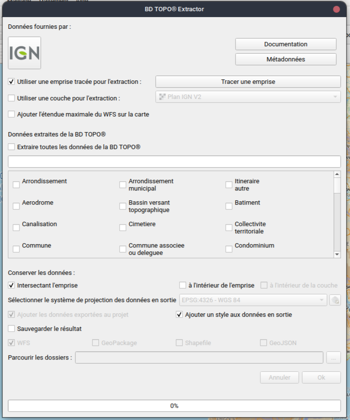
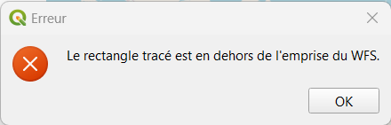
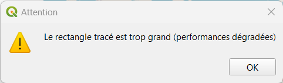

# BD TOPO® Extractor

## Description

### Pourquoi ?

Cet outil permet d'extraire les données de son choix de la BD TOPO® de l'IGN. Les données sont filtrées en fonction d'une emprise tracée par l'utilisateur sur le canevas de la carte ou en fonction de l'emprise d'une couche d'information géographique. Les donées dont issues du service WFS de l'IGN depuis la [Géoplateforme](https://www.ign.fr/geoplateforme).

### Comment on l'utilise

4 étapes sont nécéssaires pour utiliser le BD TOPO® Extractor :

1. Sélectionner une emprise à utiliser pour l'extraction.

1. Sélectionner les données à extraire.

1. Sélectionner si l'on souhaite découper les données extraites par l'emprise ou garder les entités intersectant l'emprise intactes.

1. Sélectionner si vous souhaitez sauvegarder le résultat et sous quel format.

## Documentation

Voici l'interface utilisateur du plugin :

### Sélectionner une emprise

Il est possible de :

- dessiner un rectangle sur la carte (par défaut)
- sélectionner une couche d'information géographique présente dans le projet et utilisé son emprise ou son contour.

2 cases à cocher permettent de sélectionner la méthode de création de l'emprise pour l'extraction de données :

- `Utiliser une emprise tracée pour l'extraction :` si l'on souhaite utiliser une emprise déssinée. Puis il faut cliquer sur le bouton `Dessiner une emprise` et tracer un rectangle sur la cart.

- `Utiliser une couche pour l'extraction :` si l'on souhaite utiliser l'emprise ou le contour d'une couche de données géographiques. Il faut ensuite choisir la couche sur lequel sera basée la découpe dans la liste déroulante.

#### Messages d'erreur

La couche sélectionne ou le rectangle déssinée est en dehors de l'emprise maximale des données WFS.

Vous pouvez utiliser la case à cocher `Ajouter l'étendue maximale du WFS sur la carte` pour ajouter une couche d'information géographique dans votre projet montrant l'étendue du WFS.

L'emprise sélectionnée est trop grande, le traitement peut prendre un temps conséquent.

### Sélectionner les données à extraire

Toutes les données du WFS sont listées dans la partie centrale de l'interface utilisateur. Il est soit possible de télécharger toutes les données en cochant la case `Extraire toutes les données de la BD TOPO®` ou de sélectionner uniquement les données que l'on souhaite télécharger en cochant leur case respective.

### Sélectionner la géométrie des données exportées

Il est possible d'extraire toutes les entités qui intersectent l'emprise sélectionnée (par défaut) en cochant la case `Intersectant l'emprise` ou de découper les entités en fonction de l'emprise en cochant la case `à l'intérieur de l'emprise`. Il est également possible d'extraire uniqument les données à l'intérieur de la couche sélectionnée en cochant la case `à l'intérieur de la couche`.

### Sélectionner le format de sortie

### Sauvegarder le résultat dans une couche temporaire

Si l'on ne souhaite pas sauvegarder les données extraites dans un fichier (par défaut), il est seulement nécéssaire de sélectionner le système de projection en sortie. Le système de projection sera `4326 - WGS 84` si le format de sortie WFS est sélectionné, il s'agit du système de projection du WFS.

#### Sauvergarder le résultat

Si l'on souhaite sauvegarder les données dans un fichier il faut :

- sélectionner le système de projection en sortie avec la liste déroulant
- cocher la case `Enregistrer le résultat :`.
- sélectionner si l'on souhaite ajouter les données exportées au projet (par défaut) ou non.
- sélectionner le format du fichier, `GeoPackage`, `Shapefile` ou `GeoJSon`.
- sélectionner le dossier en sortie pour enregistrer les données dans un dossier appelé `BDTopoExport_yyyymmdd_HHMM`.

Si le format GeoPackage est sélectionné, seulement un seul fichier contenant toutes les données sera crée dans le dossier.

Si vous ne souhaitez pas sauvergarder le résulat, le format de sortie sera par défaut :

- `WFS` si vous avez sélectionné de conserver les données intersectant l'emprise.
- `GeoPackage` (comme couche temporaire) si vous avez sélectionné de conserver les données à l'intérieur de l'emprise.
- `GeoPackage` (comme couche temporaire) si vous avez sélectionné de conserver les données à l'intérieur de la couche d'information géographique.

### Lancer l'extraction

L'extraction débute quand le bouton `OK` est préssé.

## Outils supplémentaires

En cliquant sur le bouton IGN, une redirection vers leur site est effectué. En cliquant sur le bouton `Documentation`, une redirection vers cette page est effectué. En cliquant sur le bouton `Metadata`, une redirection vers la page de description de la BD TOPO®. Un fond de carte Plan IGN V2 est automatiquement ajouté au projet si il n'y a aucune couche d'information géographique présente.
